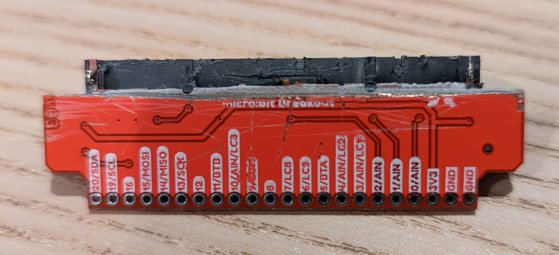

# Face Following Robot Car
How to control a ring:bit robot car to always face you at a fixed distance,
using a Person Sensor from MicroPython on a BBC micro:bit mounted on a ring:bit.

The [Person Sensor](https://usfl.ink/ps) from [Useful Sensors](https://usefulsensors.com)
is a small, low-cost hardware module that detects nearby peoples’ faces, and
returns information about how many there are, where they are relative to the
device, and performs facial recognition. It is designed to be used as an input
to a larger system, and this example shows how to program a [ring:bit robot car](https://www.elecfreaks.com/ring-bit-car-v2-for-micro-bit.html)
to follow you using a [BBC micro:bit board](https://microbit.org/) with
MicroPython. For a full developer's guide, see [usfl.ink/ps_dev](https://usfl.ink/ps_dev).

## BoM

To build this project you'll need:

 - [Micro:bit board](https://microbit.org/buy/).
 - [Ring:bit robot car](https://www.adafruit.com/product/4442)
 - [Person Sensor from Useful Sensors](https://usfl.ink/ps).
 - [Qwiic connector cable](https://www.sparkfun.com/products/14427).
 - [SparkFun Qwiic micro:bit breakout](https://www.sparkfun.com/products/16445).

I suggest the SparkFun breakout because it converts the micro:bit's small I2C
pins into a standard Qwiic socket, but if you're skilled at soldering you could
attach the wires directly to the edge pins on the board instead.

No soldering is required for this project, but if you want to use the breakout
you will need to cut off the top 5mm of the backing board, because the ring:bit
also has a board that needs to connect with the micro:bit, and that connection
isn't mechanically possible otherwise. As far as I can tell there are no wires
in this section, and the robot and breakout both work after this surgery, but it
does mean it's not quite plug and play. I suggest using a small jewelers saw for
this process. Here's what the completed result looks like:

## Assembling

First assemble the ring:bit according to the [manufacturer's instructions](https://www.elecfreaks.com/learn-en/microbitKit/ring_bit_v2/ring_bit_car_v2_assembly_step.html).
Test to make sure that you're able to run some sample programs on it.

Now remove the micro:bit from the car and slot it into the breakout slot, with the two I2C sockets on the breakout facing in the same direction as the front of the board (the side with the buttons and LED display on it). Plug one end of the Qwiic cable into either
of the breakout's I2C sockets, and the other into the socket at the top of the
person sensor. If you power the micro:bit board, you should see the green LED
on the person sensor light up when you point it at yourself.

You will now need to rescrew the micro:bit back into the ring:bit backing board.
With the top of the breakout removed, you should just about have room, though
you may need to move the micro:bit a few millimeters higher in the breakout's
slot.

Once that is in place, fix the person sensor to the top of the backing board, so
that it's facing horizontally forward. I've used Blu Tack to fix it in place in
this example:

## Running

Create a new project in the [Python micro:bit editor](https://python.microbit.org/v/3).
Click on the `Open` button, and choose the `main.py` file in this folder. Then
choose `Open` again and select the `Ringbit.py` file. When you're asked if you
want to replace `main.py`, click on a small icon to the right of the dialog and
pick the option to add it to the project under its original name. Make sure you
have your micro:bit plugged in and click `Send to micro:bit` to upload the
program to the board.

After it has uploaded, place your ring:bit on a flat surface and move so the
sensor can see your face. You should find that the robot rotates to face you,
and moves forwards and backwards to keep you about two feet away. If you move
from side to side it should follow you, and it should also move to keep about
the same distance from you. You can alter the speed, distance, and other
behaviors by modifying the constants around line 34 in `main.py`.